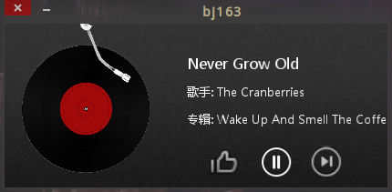

# bj163
用cocos2d-python写网易云音乐的私人fm  
//请勿模仿  
//写图形界面请老老实实用Tk/Gtk/Qt...  

### Screenshot

### Usage
$ python3 bj163.py  

### Depends
python3
cocos  
requests  
PyCrypto

### Authors
bjong

### License (MIT)
